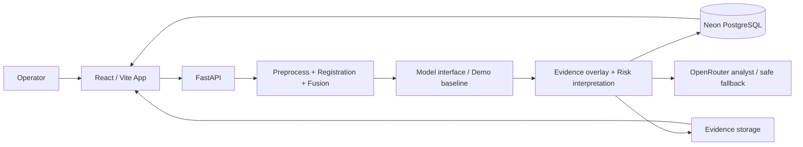

# EvoThermGuard

**Environment-Aware Evolutionary Deep Learning for Multispectral Thermal Anomaly Detection**

EvoThermGuard is a full-stack, decision-support platform for thermal inspection of transformer and electrical equipment. It combines an RGB image, a thermal image and submitted environmental context into a traceable inspection record with generated visual evidence and operator-facing guidance.

> Research integrity: EvoThermGuard does not diagnose equipment failure, guarantee a failure prediction, or replace qualified engineering review. Thermal visualisation images are not treated as radiometric temperature matrices.

## What is implemented

- JWT account registration, sign-in, protected routes and owner-scoped data access.
- Equipment registry; inspection creation; JPEG/PNG validation; UUID evidence storage outside the database.
- OpenCV preprocessing, ORB/homography registration with low-confidence fallback, visual fusion, and a generated model-attributed-region overlay.
- Deterministic, image-derived baseline risk engine using thermal distribution/texture and entered environmental values. It is always shown as **BASELINE / UNVALIDATED MODEL**.
- Traceable inspections, prediction probabilities, internal high-risk alerts, maintenance feedback schema, history, risk display, and an inspection-aware AI Analyst.
- OpenRouter integration only for narrative explanation. It gets structured inspection data and fails safely to deterministic language; inference never waits on it.
- React command-center UI with responsive layout, mobile dock, evidence grid and scientific positioning.
- Training and optimisation scaffolding; model lab deliberately presents no fake metrics or NSGA-II records.

## Architecture



## Project layout

```text
EvoThermGuard/
├── frontend/                 React, TypeScript, Vite command center
├── backend/
│   ├── app/                  FastAPI API, models, services, ML modules
│   ├── ml_training/          labelled-data training / evaluation scaffolding
│   ├── alembic/              migration configuration
│   └── storage/              local development evidence only
├── docker-compose.yml
├── .env.example
└── README.md
```

## Local setup

1. Copy `.env.example` to `.env` and configure `DATABASE_URL` for Neon PostgreSQL. The checked-in development fallback is SQLite only for local exploration.
2. Create and activate a Python 3.11 environment, then install backend dependencies:

   ```bash
   cd backend
   pip install -r requirements.txt
   alembic revision --autogenerate -m "initial schema"
   alembic upgrade head
   uvicorn app.main:app --reload
   ```

3. In another terminal start the frontend:

   ```bash
   cd frontend
   npm install
   npm run dev
   ```

Open `http://localhost:5173`; API health is available at `http://localhost:8000/health` and `http://localhost:8000/api/v1/health`.

## Configuration

| Variable | Purpose |
| --- | --- |
| `DATABASE_URL` | Neon async PostgreSQL URL (`postgresql+asyncpg://…`) |
| `JWT_SECRET` | long random production signing secret |
| `FRONTEND_URL` | exact allowed frontend origin |
| `MODEL_MODE` | `demo` by default; `trained` only with a real checkpoint/inference implementation |
| `MODEL_CHECKPOINT` | trained checkpoint location |
| `OPENROUTER_API_KEY` | optional explanation service key; never frontend-exposed |
| `STORAGE_PATH` | evidence directory (local development only) |

## API overview

- `POST /api/v1/auth/register`, `POST /auth/login`, `GET /auth/me`
- `GET|POST /api/v1/equipment`
- `POST /api/v1/inspections`, `POST /inspections/{id}/images`, `POST /inspections/{id}/analyze`
- `GET /api/v1/inspections`, `GET /inspections/{id}`, `GET /inspections/{id}/result`
- `POST /api/v1/inspections/{id}/feedback`, `GET /api/v1/alerts`
- `POST /api/v1/ai/inspections/{id}`, `GET /api/v1/models/status`, `GET /api/v1/experiments`

## Demo vs. trained model

The current demo baseline uses measured pixel statistics from the submitted thermal visualisation and the submitted environment values. It is deterministic but **not scientifically or engineering validated**. It must not be used as a failure predictor.

For a research model, provide labelled multimodal data with the manifest fields `rgb_path`, `thermal_path`, `ambient_temperature`, `humidity`, `weather`, `season`, `time_of_day`, and `label`. Implement/train the dual-branch RGB + thermal + environment architecture, validate on held-out data, save real metrics/checkpoints, and then set `MODEL_MODE=trained`. NSGA-II is opt-in and must never run at server startup.

## Docker

```bash
copy .env.example .env
docker compose up --build
```

Use a Neon database; the compose stack deliberately does not create a local Postgres service. For production, deploy `frontend` to Vercel, `backend` to Railway, set `VITE_API_URL` to the Railway `/api/v1` URL, allow the Vercel origin through `FRONTEND_URL`, and replace local evidence storage with S3/R2/Supabase Storage—Railway disk is ephemeral.

## Remaining research work

- Train and independently evaluate the real PyTorch dual-branch architecture with correctly labelled/radiometric data where applicable.
- Implement checkpoint loading and true CNN Grad-CAM for that trained architecture.
- Run and persist real NSGA-II experiments.
- Add a production object-store implementation, migration revision committed from the generated initial schema, and optional SMTP delivery configuration.
